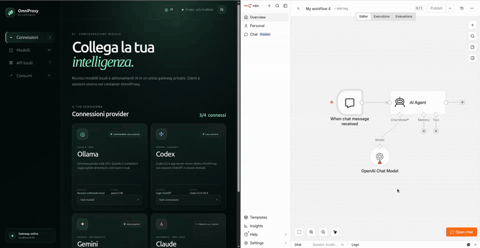

# OmniProxy AI

[](LICENSE)

> **Already paying monthly for an AI account? OmniProxy brings that access to
> your applications and workflows through one local OpenAI-compatible API,
> while you monitor requests, tokens, latency and quotas.**

**Status:** Phase 1 public preview · **Experimental Builder:** disabled by
default · **Hosts:** Linux / Windows (WSL2) / macOS · **Dashboard:** English /
Italian / Spanish / French

[Italian documentation](README.md) ·
[Demo video guide](docs/DEMO_VIDEO.md) ·
[Security](SECURITY.md) ·
[Contributing](CONTRIBUTING.md) ·
[Issues](https://github.com/nickali00/OmniProxy-AI/issues)

## The core use case

Do you pay monthly for a ChatGPT/Codex, Google AI/Gemini or Claude account and
want to use it from OpenClaw, your applications, automations or workflows?
OmniProxy acts as the local bridge between that account and your tools:

```text
Your AI account → OmniProxy → one API for apps, backends and workflows
                                      ↓
                         usage and routing under control
```

OmniProxy exposes `/v1/chat/completions`, authenticates every application with
a local key, and uses the provider, model and reasoning profile you selected.
Clients keep the same endpoint even when you change the model behind it.

That is its calling card: **centralize supported AI accounts for your own
applications and monitor their usage in one place.**

It does not turn a consumer subscription into an official API key. Supported
official clients are executed as local adapters, and all usage remains subject
to each provider's plan, quota and terms.

## Beyond n8n

n8n is only one possible example. OmniProxy can be configured as a custom
provider for:

- [OpenClaw](https://openclaw.ai/);
- workflow and automation platforms such as n8n;
- backends, agents, chatbots, and desktop or web applications;
- scripts, SDKs, and purpose-built software;
- any client that lets you configure an **OpenAI-compatible Base URL**, an API
  key, and a model.

Existing clients use the OmniProxy Base URL and a local `sk-local-...` key.
Custom applications can call `/v1/chat/completions` and `/v1/models`
directly. An application that is locked to a vendor endpoint and does not
support a custom Base URL requires an adapter.

### Local by default

OmniProxy is designed to remain private. The default configuration binds its
port to `127.0.0.1`, therefore:

- OpenClaw or an application on the same host uses
  `http://127.0.0.1:8000/v1`;
- n8n or another application on the `omni-proxy-ai-network` Docker network
  uses `http://gateway:8000/v1`;
- an application on another computer cannot reach the loopback address
  directly.

For clients outside the host, prefer a **private VPN**. Alternatively, use an
HTTPS reverse proxy with administrative authentication, request limits, and
an allowlist that exposes `/v1/*` only. Keep the dashboard and administrative
routes private. **Never expose port `8000` directly to the Internet.**

## What it is for

- Bring supported AI accounts into OpenClaw, n8n, backends, automations, and
  custom applications through one OpenAI-compatible endpoint.
- Automatic Ollama discovery and optional managed GPU container.
- Isolated sidecars for Codex, Gemini/Antigravity and Claude clients.
- Stable managed API profiles locked to a provider, model and reasoning level.
- Local API-key authentication with hashed secrets.
- SQLite request, token, latency and error accounting.
- Live provider availability/quota information when officially exposed.
- A multilingual local dashboard.

## Architecture

```text
n8n / application / OpenAI-compatible client
                  |
                  | Bearer sk-local-...
                  v
        FastAPI /v1/chat/completions
                  |
        routing + managed API profile
          |           |           |
       Ollama      Codex CLI   Gemini / Claude clients
          |
   host or container, GPU optional

        SQLite: key hashes + usage metadata
```

Provider sessions live in separate Docker volumes. They are not copied into
the browser, the SQLite database or application logs.

## Cross-platform quick start

### Requirements

The core runs in Linux containers and **does not require Ubuntu**:

| Host | Gateway and cloud providers | Recommended Ollama setup |
| --- | --- | --- |
| Linux `amd64` / `arm64` | Docker Engine + Compose | host, external container, or managed profile |
| Windows 10/11 `amd64` | Docker Desktop with WSL2 and Linux containers | host Ollama or managed profile with NVIDIA/WSL2 |
| Intel / Apple Silicon macOS | Docker Desktop | native host Ollama through `host.docker.internal` |

Requirements:

- [Docker Engine and Compose on Linux](https://docs.docker.com/engine/install/),
  [Docker Desktop on Windows](https://docs.docker.com/desktop/setup/install/windows-install/),
  or [Docker Desktop on macOS](https://docs.docker.com/desktop/setup/install/mac-install/).
- Git.
- NVIDIA drivers and the
  [NVIDIA Container Toolkit](https://docs.nvidia.com/datacenter/cloud-native/container-toolkit/install-guide.html)
  only for managed Ollama GPU access on Linux. On Windows, container GPU
  access requires Docker Desktop with WSL2 and a supported NVIDIA GPU.

The v0.1 CI currently validates Linux automatically. Windows/WSL2 and macOS
are supported by the container design but have not yet been added to the
public CI matrix.

### Install

```bash
git clone https://github.com/nickali00/OmniProxy-AI.git
cd OmniProxy-AI
cp .env.example .env
```

In PowerShell, replace `cp` with `Copy-Item .env.example .env`.

Edit `.env` and replace the bootstrap key with a random value starting with
`sk-local-` and containing at least 32 characters:

```dotenv
BOOTSTRAP_API_KEY=sk-local-change-me-with-a-long-random-secret
```

Never commit or share `.env`.

Start the gateway while using an existing Ollama instance:

```bash
docker compose up -d --build
```

On NVIDIA Linux or Windows/WSL2 with verified container GPU access, let the
Compose profile run Ollama:

```bash
docker compose --profile managed-ollama up -d --build
```

Verify:

```bash
docker compose ps
curl http://127.0.0.1:8000/healthz
```

Open `http://127.0.0.1:8000/`. If port 8000 is unavailable, change
`GATEWAY_PORT` in `.env`.

## First managed API

1. Connect a provider from **Connections**, or start Ollama.
2. Open **Models** and select a model that is currently available.
3. Select **Create API with this model**.
4. Name the API, choose its reasoning level and save it.
5. Copy the generated `sk-local-...` secret immediately. It is shown once.
6. Configure your client with:

```text
Base URL: http://127.0.0.1:8000/v1
API key:  sk-local-...
Model:    the stable slug shown by OmniProxy
```

## API example

```bash
curl http://127.0.0.1:8000/v1/chat/completions \
  -H "Authorization: Bearer $OMNIPROXY_API_KEY" \
  -H "Content-Type: application/json" \
  -d '{
    "model": "your-managed-model-slug",
    "messages": [{"role": "user", "content": "Hello from OmniProxy"}]
  }'
```

For an n8n container attached to `omni-proxy-ai-network`, use
`http://gateway:8000/v1` instead of the host URL.

## Demo video



The complete demo plays directly inside this README. It shows a managed API
being created, an n8n OpenAI node being configured, a real request, and usage
metrics updating. n8n is simply the client used in this example. To pause or
seek, use the
[online player with controls](https://nickali00.github.io/OmniProxy-AI/).
The
[MP4 file](https://github.com/nickali00/OmniProxy-AI/releases/download/v0.1.0/omniproxy-ai-demo-v0.1.0.mp4)
is also available. The
[video guide](docs/DEMO_VIDEO.md) also provides a safe storyboard for future
recordings.

## Security model

- The dashboard binds to loopback by default.
- Local API secrets are stored only as SHA-256 hashes.
- Provider brokers expose no host ports and use separate volumes.
- Containers run non-root with read-only filesystems and dropped capabilities.
- Browser authentication is restricted to allowlisted official HTTPS origins.
- Prompt and response bodies are not shown by the usage dashboard.

Do not publish the dashboard port directly on the Internet. Remote access
requires a VPN or a TLS reverse proxy with administrative authentication and
request limits.

## Experimental Builder

The Builder workspace is excluded from the public interface and its server
routes return `404` by default. Developers can enable it locally with:

```dotenv
BUILD_ENABLED=true
```

Rebuild the gateway after changing the flag.

## Tests

```bash
python3 -m venv .venv
.venv/bin/pip install -r requirements-dev.txt
.venv/bin/pytest -q
```

## Current limitations

- SQLite targets a single gateway replica.
- `tiktoken` accounting may differ from a local model's native tokenizer.
- Tool calls, multimodal inputs and `/v1/responses` are not implemented yet.
- Cloud availability depends on account access and the official client.
- Cloud SSE output is currently emitted after the headless completion.
- The legacy `reasoning-avanzato` alias still uses a mock provider.

See the [Italian documentation](README.md) for provider authentication,
managed APIs, n8n networking and detailed security notes.

## License

OmniProxy AI is licensed under the
[GNU Affero General Public License v3.0 only](LICENSE)
(`AGPL-3.0-only`). You may use, modify, and distribute it, including
commercially, subject to the license terms. If you make a modified version
available over a network, you must offer its users the corresponding source
code.

Copyright © 2026 Nicola Alì.
