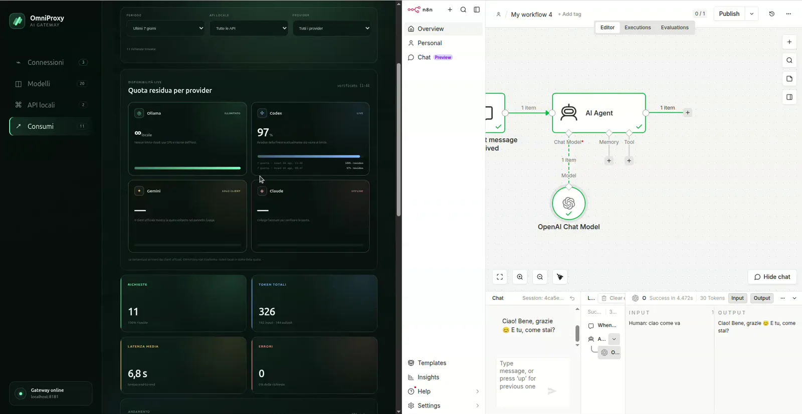

# OmniProxy AI

[](LICENSE)

> **Paghi già un account AI ogni mese? OmniProxy porta quell'accesso nelle tue
> applicazioni e nei tuoi workflow tramite un'unica API locale
> OpenAI-compatible, mentre tu controlli richieste, token, latenza e quote.**

**Stato:** Phase 1 public preview · **Builder sperimentale:** disabilitato di
default · **Dashboard:** EN / IT / ES / FR

[English documentation](README.en.md) ·
[Guida video](docs/DEMO_VIDEO.md) ·
[Sicurezza](SECURITY.md) ·
[Contribuire](CONTRIBUTING.md) ·
[Segnalazioni](https://github.com/nickali00/OmniProxy-AI/issues)

## Il caso d'uso fondamentale

Hai un account ChatGPT/Codex, Google AI/Gemini o Claude che paghi mensilmente e
vuoi usarlo anche in OpenClaw, nelle tue applicazioni, automazioni o workflow?
OmniProxy è il ponte locale tra quell'account e i tuoi strumenti:

```text
Il tuo account AI → OmniProxy → un'API per app, backend e workflow
                                      ↓
                         consumi e routing sotto controllo
```

OmniProxy espone `/v1/chat/completions`, autentica ogni applicazione con una
chiave locale e usa il provider, il modello e il reasoning che hai scelto. I
client continuano a parlare con lo stesso endpoint anche quando modifichi il
modello dietro le quinte.

Questo è il suo biglietto da visita: **riutilizzare in modo centralizzato gli
account AI supportati nelle proprie applicazioni e monitorarne il consumo da
un solo posto.**

Dashboard locale predefinita: `http://127.0.0.1:8000/`.

## Non solo n8n

n8n è soltanto uno degli esempi possibili. OmniProxy può essere configurato
come provider personalizzato in:

- [OpenClaw](https://openclaw.ai/);
- piattaforme di workflow e automazione come n8n;
- backend, agenti, chatbot e applicazioni web o desktop;
- script, SDK e software sviluppati su misura;
- qualunque client che permetta di impostare un **Base URL
  OpenAI-compatible**, una API key e un modello.

Per i client esistenti si usano il Base URL di OmniProxy e una chiave locale
`sk-local-...`. Le applicazioni custom possono chiamare direttamente
`/v1/chat/completions` e `/v1/models`. Un'applicazione che accetta soltanto
l'endpoint fisso di un singolo produttore, senza Base URL personalizzabile,
richiede invece un adattatore.

## A cosa serve

- portare gli account AI supportati dentro OpenClaw, n8n, backend,
  automazioni e applicazioni custom attraverso un unico endpoint
  OpenAI-compatible;
- collegare Ollama, Codex/ChatGPT, Gemini e Claude da un'interfaccia unica;
- creare API locali vincolate a uno specifico provider, modello e livello di
  reasoning;
- cambiare il modello reale senza modificare la configurazione dei client;
- registrare richieste, token, latenza ed errori in SQLite senza mostrare
  prompt o segreti nella dashboard;
- consultare, quando il client ufficiale lo permette, la quota residua dei
  provider;
- mantenere client e sessioni cloud in container Docker separati.

OmniProxy non vende né converte abbonamenti in API key ufficiali. Esegue i
client supportati come adattatori locali e ogni utilizzo rimane soggetto al
piano, alle quote e ai termini del provider collegato.

## Installazione rapida

### 1. Prerequisiti

- Ubuntu 22.04 o successivo;
- [Docker Engine con Compose plugin](https://docs.docker.com/engine/install/ubuntu/);
- Git;
- driver NVIDIA e
  [NVIDIA Container Toolkit](https://docs.nvidia.com/datacenter/cloud-native/container-toolkit/install-guide.html)
  soltanto per eseguire Ollama con GPU tramite questo Compose.

Verificare l'ambiente:

```bash
docker --version
docker compose version
git --version
```

### 2. Scaricare e configurare OmniProxy

```bash
git clone https://github.com/nickali00/OmniProxy-AI.git
cd OmniProxy-AI
cp .env.example .env
```

Aprire `.env` e sostituire obbligatoriamente:

```dotenv
BOOTSTRAP_API_KEY=sk-local-change-me-with-a-long-random-secret
```

con una chiave casuale che inizi con `sk-local-` e contenga almeno 32
caratteri. Non pubblicare mai il file `.env`.

### 3. Avviare

Se Ollama è già disponibile sull'host o in un altro container:

```bash
docker compose up -d --build
```

Per avviare anche Ollama con GPU e volume modelli gestito:

```bash
docker compose --profile managed-ollama up -d --build
```

Controllare lo stato:

```bash
docker compose ps
curl http://127.0.0.1:8000/healthz
```

Tutti i servizi richiesti devono risultare `healthy`.

### 4. Configurare il primo provider e creare un'API

1. Aprire `http://127.0.0.1:8000/`.
2. Collegare un provider dalla sezione **Connessioni**, oppure avviare Ollama.
3. Aprire **Modelli** e scegliere uno dei modelli realmente disponibili.
4. Premere **Crea API con questo modello**.
5. Assegnare un nome, scegliere il reasoning e salvare.
6. Copiare subito la chiave `sk-local-...`: viene mostrata una sola volta.
7. Usare Base URL `http://127.0.0.1:8000/v1` e lo slug modello mostrato.

Se la porta `8000` è occupata, modificare `GATEWAY_PORT` nel file `.env`.

## Video dimostrativo

[](https://nickali00.github.io/OmniProxy-AI/)

[Riproduci la demo direttamente online (1:49, senza audio)](https://nickali00.github.io/OmniProxy-AI/).
Il filmato mostra la creazione di un'API gestita, la configurazione del nodo
OpenAI in n8n, una chiamata reale e l'aggiornamento dei consumi: n8n è
soltanto il client scelto per l'esempio. È disponibile anche il
[file MP4](https://github.com/nickali00/OmniProxy-AI/releases/download/v0.1.0/omniproxy-ai-demo-v0.1.0.mp4).
La
[guida video](docs/DEMO_VIDEO.md) contiene anche lo storyboard per registrare
demo future in sicurezza.

## Architettura

```text
Client (n8n / app / qualunque client OpenAI-compatible)
        |
        | Authorization: Bearer sk-local-...
        v
FastAPI  /v1/chat/completions
        |
        +-- model=base|local ----------> autodiscovery Ollama GPU
        |
        +-- model=reasoning-avanzato --> ExternalReasoningMockProvider
        |
        +-- managed API key -----------> profilo SQLite vincolato
                                         provider + model + reasoning
        |
        +------------------------------> SQLite (key hash + usage log)

Browser dashboard (solo loopback)
        |
        +-- status/login ufficiale ----> FastAPI
                                           |
                +--------------------------+--------------------------+
                |                          |                          |
          Codex broker             Antigravity broker          Claude broker
          + Codex CLI              + Antigravity CLI           + Claude Code
                |                          |                          |
          auth.openai.com          accounts.google.com              claude.com
```

Il client sceglie un alias, non un URL o una credenziale. Questa impostazione
riprende la registry dei provider di CodeNexus e il controllo server-side del
gateway ANAC.

OmniProxy è completamente autonomo: non monta la home dell'utente, non legge
sessioni di estensioni e non richiede VS Code, Codex Extension o
l'applicazione desktop Antigravity. Codex, Antigravity e Claude utilizzano i
client ufficiali installati e isolati nei rispettivi sidecar. Ollama non
richiede login e viene raggiunto tramite la sua API locale quando il container
è individuabile.

## Struttura

```text
.
├── app/
│   ├── providers/
│   │   ├── cli_broker.py
│   │   ├── cloud_mock.py
│   │   └── ollama.py
│   ├── auth.py
│   ├── cli.py
│   ├── config.py
│   ├── dashboard_security.py
│   ├── database.py
│   ├── errors.py
│   ├── main.py
│   ├── provider_broker.py
│   ├── provider_vault.py
│   ├── provider_status.py
│   ├── routing.py
│   ├── schemas.py
│   ├── token_counter.py
│   ├── static/dashboard.{css,js}
│   └── templates/dashboard.html
├── codex-broker/        # Codex CLI + app-server, auth ChatGPT
├── antigravity-broker/  # Antigravity CLI, auth Google e modelli Gemini
├── claude-broker/       # Claude Code, auth Claude.ai
├── maintenance-runner/  # comandi Docker allowlistati, solo rete interna
├── provider-common/     # validazione e runtime headless condivisi
├── tests/
│   ├── test_gateway.py
│   ├── test_managed_apis.py
│   └── test_provider_auth.py
├── .env.example
├── Dockerfile
├── docker-compose.yml
├── pyproject.toml
├── requirements.txt
└── requirements-dev.txt
```

## Avvio su Ubuntu + RTX 5070 Ti

Prerequisiti: Docker Engine e Docker Compose. Driver NVIDIA e NVIDIA Container
Toolkit sono necessari soltanto se OmniProxy deve avviare il proprio Ollama con
GPU.

```bash
cp .env.example .env
```

Cambiare obbligatoriamente `BOOTSTRAP_API_KEY` in `.env`, mantenendo il
prefisso `sk-local-` e almeno 32 caratteri.

Se Ollama è già in esecuzione in un altro container o sull'host:

```bash
docker compose up -d --build
```

OmniProxy prova, nell'ordine, l'URL configurato, il DNS Docker `ollama` e
`host.docker.internal:11434`. Il gateway continua ad avviarsi anche se Ollama
non è presente.

Per fare gestire a questo Compose anche Ollama e il download del modello:

```bash
docker compose --profile managed-ollama up -d --build
```

Il profilo pubblica Ollama soltanto su `127.0.0.1:11434`, abilita la GPU e
conserva i modelli nel volume `ollama_data`.

Per eseguire gli esempi, esportare nella shell lo stesso valore impostato nel
file `.env`:

```bash
export BOOTSTRAP_API_KEY='sk-local-...'
```

La porta predefinita è `8000`; può essere modificata tramite `GATEWAY_PORT`
nel file `.env`. Verifica:

```bash
curl http://127.0.0.1:8000/healthz

curl http://127.0.0.1:8000/v1/models \
  -H "Authorization: Bearer $BOOTSTRAP_API_KEY"

curl http://127.0.0.1:8000/v1/chat/completions \
  -H "Authorization: Bearer $BOOTSTRAP_API_KEY" \
  -H "Content-Type: application/json" \
  -d '{
    "model": "local",
    "messages": [{"role": "user", "content": "Rispondi in italiano: sei attivo?"}]
  }'
```

Streaming:

```bash
curl -N http://127.0.0.1:8000/v1/chat/completions \
  -H "Authorization: Bearer $BOOTSTRAP_API_KEY" \
  -H "Content-Type: application/json" \
  -d '{
    "model": "reasoning-avanzato",
    "messages": [{"role": "user", "content": "Prepara un piano breve"}],
    "stream": true,
    "stream_options": {"include_usage": true}
  }'
```

## Catalogo modelli e API vincolate

La release pubblica della dashboard è disponibile in inglese, italiano,
spagnolo e francese e contiene quattro sezioni operative:

1. **Connessioni:** rilevamento e login dei provider.
2. **Modelli:** catalogo dinamico separato in schede per provider, con
   disponibilità e livelli di reasoning.
3. **API locali:** creazione, modifica e cancellazione delle configurazioni.
4. **Consumi:** richieste, token, latenza e quota disponibile per provider.

Una API gestita contiene:

- nome descrittivo;
- slug modello pubblico e immutabile;
- provider;
- modello concreto;
- livello di reasoning;
- chiave `sk-local-...` mostrata una sola volta.

Quando una chiave gestita chiama `/v1/chat/completions`, OmniProxy ignora un
eventuale modello differente nel payload e forza sempre la configurazione
salvata. Modificare provider, modello o reasoning non cambia Base URL, chiave o
slug. Eliminare l'API revoca immediatamente la chiave, conservando i log
consumi già registrati.

Il catalogo Ollama interroga anche `/api/show`: i modelli solo-embedding non
sono proposti per Chat Completions e l'opzione reasoning viene mostrata
soltanto quando Ollama dichiara la capability `thinking`.

Nella sezione **Modelli** non esiste una vista aggregata: vengono mostrate
soltanto le schede dei provider collegati che espongono almeno un modello.
Selezionando, per esempio, Gemini si vedono esclusivamente i modelli Gemini.
I provider non disponibili restano nella sezione **Connessioni** e compaiono
nel catalogo solo dopo una connessione valida.

## Workspace Build

Il workspace Build è sperimentale e nella release pubblica è disabilitato sia
nell'interfaccia sia negli endpoint server. In un ambiente di sviluppo può
essere riattivato impostando `BUILD_ENABLED=true` e ricostruendo il servizio.

La sezione `http://127.0.0.1:8000/#build` permette di creare più progetti e
assegnare separatamente provider, modello e reasoning a due ruoli:

- **Analista idea:** comprende l'obiettivo, individua requisiti e rischi e
  prepara istruzioni più precise; può lavorare in modalità **Schematica**
  (pochi token, nessun codice) oppure **Dettagliata**;
- **Builder:** usa il piano e lo snapshot del progetto per lavorare su una fase
  alla volta.

La pipeline non produce un unico prompt. Esegue quattro passaggi sequenziali e
salva in SQLite:

1. comprensione dell'idea;
2. brief tecnico per il Builder;
3. roadmap in fasi brevi e indipendenti con criteri di accettazione;
4. possibili migliorie future ordinate per valore e costo.

La chat resta associata al progetto e può essere indirizzata all'Analista o al
Builder. Le fasi diventano una checklist persistente: il Builder riceve solo la
fase corrente, la patch passa allo stato “da applicare” e la fase successiva
parte soltanto dopo scrittura verificata e sincronizzazione dello snapshot.

### Associazione sicura della cartella

La cartella viene selezionata con il File System Access API del browser. Il
container non riceve accesso generale al filesystem host e non dipende da VS
Code. OmniProxy conserva in SQLite uno snapshot testuale usato dai modelli; il
browser mantiene localmente l'handle necessario alle sincronizzazioni.

Quando il Builder produce modifiche, il gateway valida una patch unified diff
contro lo snapshot e restituisce al browser soltanto i file risultanti. La chat
mostra sempre i percorsi esatti. In modalità standard richiede una conferma
esplicita; attivando **Autopilot**, il browser domanda una sola volta il permesso
`readwrite` sulla cartella collegata e le patch valide successive vengono
applicate automaticamente senza conferme ripetute. Nei nuovi progetti
Autopilot viene attivato insieme al collegamento della cartella; per i progetti
già esistenti si abilita una volta dal pulsante nell'intestazione del workspace.
L'attivazione aggiorna anche lo snapshot completo prima di accettare nuove
proposte del Builder.

Il permesso resta limitato alla cartella scelta; `.env`, credenziali, directory
escluse e percorsi esterni continuano a non essere inviati né modificati. Prima
della scrittura viene verificato l'hash di ogni file e, in caso di errore,
OmniProxy tenta il rollback dei file già aggiornati. Se il browser revoca il
permesso, Autopilot si disattiva e richiede un nuovo clic. Il container non
ottiene mai accesso diretto alle altre cartelle dell'host.

L'indice accetta fino a 2.000 file testuali UTF-8 e 50 MB per progetto,
indipendentemente dall'estensione, e passa al Builder anche il manifesto dei
percorsi disponibili. Restano esclusi automaticamente `.env`, chiavi private,
credenziali, `.git`, directory IDE, dipendenze, output di build e file binari.
Il contenuto dei file non viene restituito dagli endpoint di dettaglio.

### Aggiornamento container dal Builder

Il servizio `maintenance-runner` è indipendente da VS Code, non pubblica porte
host e riceve il socket Docker su una rete interna dedicata. Non offre una
shell: traduce soltanto due azioni esatte in argomenti predefiniti,
`docker compose ps` e `docker compose up -d --build --force-recreate`. Quando
l'ultima fase applicata richiede il rebuild, il Builder può accodare questa
azione; i normali endpoint OpenAI e i broker dei provider non hanno accesso al
socket Docker. Il runner è inoltre vincolato al workspace OmniProxy montato in
Compose: non esegue comandi Docker per altri progetti collegati dal browser.

## Chiavi amministrative

SQLite conserva solo SHA-256 e un hint della chiave, non il segreto. Per creare
una chiave distinta per n8n:

```bash
docker compose exec gateway python -m app.cli create-key --name n8n
docker compose exec gateway python -m app.cli list-keys
docker compose exec gateway python -m app.cli revoke-key --id 2
```

La chiave nuova viene mostrata una sola volta. Ogni log contiene API key
interna, alias richiesto, provider scelto, modello reale, token, latenza ed
esito.

## Collegare gli account senza applicazioni desktop

Aprire `http://127.0.0.1:8000/` e scegliere il provider. OmniProxy prepara la
richiesta e apre sempre la pagina ufficiale nel browser. Password, passkey, SSO
e MFA vengono digitati esclusivamente sul dominio del provider.

- **Codex / ChatGPT:** Codex app-server produce un device code. La dashboard
  apre esclusivamente `https://auth.openai.com/codex/device`; il codice
  mostrato da OmniProxy viene inserito sulla pagina OpenAI.
- **Gemini / Google:** Antigravity CLI produce un Authorization Code OAuth con
  PKCE. La dashboard apre esclusivamente `accounts.google.com`; il codice
  monouso visualizzato dopo il consenso viene inoltrato in memoria al sidecar.
- **Claude / Anthropic:** Claude Code apre esclusivamente
  `https://claude.com/cai/oauth/authorize`. L'eventuale codice monouso viene
  inoltrato in memoria al processo Claude Code.
- **Ollama:** nessun account e nessun OAuth; la dashboard interroga
  direttamente `/api/tags` quando trova il container.

I broker non espongono porte sull'host, girano non-root, hanno root filesystem
read-only, capability eliminate, rete interna dedicata verso il gateway e
volume credenziali separato. Le sessioni dei client ufficiali non vengono
restituite al JavaScript, copiate in SQLite o scritte nei log. Antigravity usa
il volume `antigravity_auth`, separato dai volumi Codex, Claude, database e
vault.

Le richieste mutative richiedono origin locale e un header same-origin; una
Host allowlist blocca il DNS rebinding. La dashboard è pubblicata soltanto su
loopback.

Il volume Docker è isolamento, non cifratura a riposo: per protezione contro
furto del disco usare cifratura Ubuntu/LUKS. Non esporre la dashboard tramite
port forwarding o reverse proxy finché non verrà aggiunto il login
amministratore locale.

### Collegare Gemini con Antigravity

Non serve creare un progetto Google Cloud, abilitare la Gemini API, scaricare
`client_secret.json` o inserire una API key.

1. aprire `http://127.0.0.1:8000/`;
2. nella scheda **Gemini** premere **Collega account**;
3. nella finestra Google ufficiale scegliere il proprio account e completare
   eventuali passkey o MFA;
4. la pagina di callback Antigravity mostra un codice monouso: copiarlo;
5. incollare il codice nella finestra OmniProxy e attendere lo stato
   **Collegato**.

Da quel momento OmniProxy interroga Gemini attraverso Antigravity CLI in
modalità headless. Il client è già incluso nel container: non servono
Antigravity desktop, VS Code o estensioni installate sull'host. I modelli
mostrati nella dashboard sono soltanto quelli che il client ufficiale rende
disponibili all'account collegato.

Questa integrazione usa le quote Antigravity del piano Google AI associato
all'account, non le quote della Gemini Developer API. OmniProxy non converte la
sessione in una API key, non esporta i token e non chiama endpoint Google
privati: esegue il client ufficiale come adattatore headless.

Riferimenti ufficiali:

- [installazione e uso di Antigravity CLI](https://antigravity.google/docs/cli/install);
- [piani e quote Antigravity](https://antigravity.google/docs/plans);
- [release del client Antigravity](https://github.com/google-antigravity/antigravity-cli/releases).

## n8n

Nel nodo **HTTP Request**:

- Method: `POST`
- URL dall'host: `http://127.0.0.1:8000/v1/chat/completions`.
- URL da un container n8n collegato alla rete
  `omni-proxy-ai-network`: `http://gateway:8000/v1/chat/completions`.
- Header Auth: `Authorization: Bearer sk-local-...`
- Body JSON: lo stesso payload degli esempi. Con una chiave gestita usare come
  `model` lo slug mostrato dalla dashboard; il routing resta comunque
  vincolato lato server.

Se n8n ha un altro file Compose, dichiarare lì
`omni-proxy-ai-network` come rete `external` e collegarla al servizio n8n. La
porta host resta intenzionalmente vincolata a `127.0.0.1`.

Non pubblicare direttamente la porta su Internet. Per accesso remoto usare
VPN oppure reverse proxy TLS con limiti di richiesta.

## Client compatibili e indipendenza dall'editor

Qualunque client che accetta un provider **OpenAI-compatible Chat
Completions** può usare:

- Base URL: `http://127.0.0.1:8000/v1`
- API key: una `sk-local-...`
- Model: lo slug dell'API gestita, oppure `local`, `base` o
  `reasoning-avanzato` usando la chiave bootstrap.

VS Code è soltanto uno dei possibili client e non è richiesto sul computer che
esegue OmniProxy. Il sidecar Codex contiene già app-server; non usa né legge
l'estensione ufficiale Codex.

L'estensione ufficiale Codex parla un protocollo agentico più ricco di Chat
Completions. Per la fase successiva ci sono due strade:

1. aggiungere `/v1/responses` con streaming, tool calls e semantica Codex;
2. esporre in modo controllato il `codex app-server` già isolato nel sidecar,
   come CodeNexus, per conversazioni, approval ed eventi agentici.

Il pattern ANAC (`codex exec` in un container dedicato) è adatto a task chiusi
con prompt, modello e schema JSON fissati dal server. Non è consigliabile
esporlo come esecutore arbitrario a tutti i chiamanti di un endpoint generico.

L'accesso ChatGPT e le API key OpenAI sono credenziali e piani di consumo
distinti. Il gateway non legge cookie o token da programmi installati
sull'host.

## Esecuzione provider

- Ollama usa direttamente `/api/chat`, anche in streaming.
- Codex usa `codex exec` headless con modello e reasoning validati dal catalogo
  app-server, sandbox read-only, workspace vuoto ed esecuzione effimera.
- Gemini usa Antigravity CLI ufficiale in modalità headless, con modello e
  reasoning validati dal catalogo esposto dal sidecar.
- Claude usa print mode JSON di Claude Code, safe mode, nessuna persistenza di
  sessione e tool disabilitati.

I prompt vengono inviati via `stdin`, non come argomenti di processo, e non
sono registrati nei log dei broker.

## Limiti deliberati della fase 1

- Il conteggio `tiktoken` è coerente per l'accounting del gateway, ma è una
  stima per i modelli Ollama che adottano un tokenizer differente.
- SQLite è adatto a una singola replica. Prima dello scaling orizzontale va
  sostituito con PostgreSQL o un servizio centralizzato.
- Non sono ancora implementati tool calls, immagini, audio e `/v1/responses`.
- I provider cloud funzionano soltanto quando l'account è collegato e il piano
  consente l'uso del rispettivo client ufficiale.
- Lo streaming cloud è compatibile SSE ma, per ora, viene emesso dopo il
  completamento headless; Ollama continua a trasmettere token progressivi.
- Il provider `reasoning-avanzato` restituisce intenzionalmente una risposta
  mock per retrocompatibilità. Le nuove API gestite usano invece il provider
  selezionato.

## Test

```bash
python3 -m venv .venv
.venv/bin/pip install -r requirements-dev.txt
.venv/bin/pytest -q
```

## Licenza

OmniProxy AI è distribuito sotto la
[GNU Affero General Public License v3.0 only](LICENSE)
(`AGPL-3.0-only`). Puoi usarlo, modificarlo e distribuirlo, anche in ambito
commerciale, rispettando le condizioni della licenza. Se rendi disponibile
in rete una versione modificata, devi offrire agli utenti il relativo codice
sorgente corrispondente.

Copyright © 2026 Nicola Alì.
